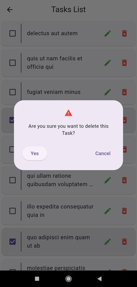

# Task Manager App

A Flutter application for managing tasks with REST API integration.

## Getting Started

These instructions will help you set up and run the Task Manager app on your local machine.

### Prerequisites

- Flutter installed on your machine. Follow the official Flutter installation guide: [Flutter Installation](https://flutter.dev/docs/get-started/install)
- Emulator or a physical device to run the app.

### Clone the Repository

Clone the Task Manager repository to your local machine:





```bash
git clone https://github.com/KhalilDev12/task_app.git
cd task_app
